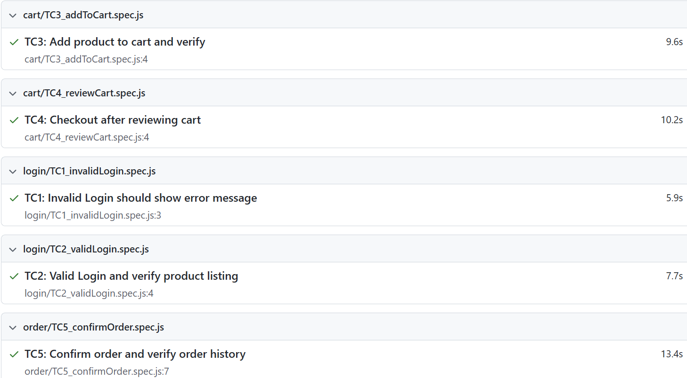

# Playwright QA Automation

This repository showcases a modular Playwright-based end-to-end test automation suite. It covers login, cart operations, and order confirmation functionalities on an e-commerce demo application.

Designed using Playwright Test Runner, this framework highlights reusable helper functions, structured test folders, and practical testing scenarios for a modern QA portfolio.

##  Folder Structure

Playwright-QA-Automation/
├── helpers/ # Reusable custom helper functions (login, cart, order, checkout)
├── tests/ # Modularized test cases grouped by functionality
│ ├── login/ # Login test cases (TC1, TC2)
│ ├── cart/ # Cart interaction test cases (TC3, TC4)
│ └── order/ # Order and checkout test case (TC5)
├── playwright.config.js # Playwright test runner configuration
├── package.json # Project dependencies and scripts
├── .gitignore # Git ignored files and folders
└── README.md # Project overview and documentation

## Test Case Summary

| Test Case ID | Description                                | Location           |
|--------------|--------------------------------------------|--------------------|
| TC1          | Invalid login should show error message    | tests/login/       |
| TC2          | Valid login and verify product listing     | tests/login/       |
| TC3          | Add product to cart and verify             | tests/cart/        |
| TC4          | Checkout after reviewing cart              | tests/cart/        |
| TC5          | Confirm order and validate order history   | tests/order/       |

## Sample Test Report

##  How to Run the Tests

1.  **Install dependencies**  
   Run the following command in your terminal:
   npm install

2.  **Run all test cases**
This will execute all the test scripts and generate a report:
npx playwright test

3.  **Open Playwright HTML report**
After the test run:
npx playwright show-report

4.  **Run a specific test file**:
npx playwright test tests/login/TC1_invalidLogin.spec.js

##  Tech Stack

This project was built using the following tools and technologies:

-  [Playwright](https://playwright.dev/) — End-to-end testing framework  
-  JavaScript — Scripting language used for writing test logic  
-  Node.js — Runtime environment for executing tests  
-  VS Code — Code editor used to build the test framework  
-  npm — Package manager for dependencies  

##  Project Badges

  
  
  

